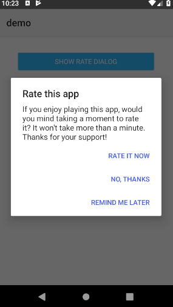

# Nativescript-rater

[](https://www.npmjs.com/package/nativescript-rater)
[](https://www.npmjs.com/package/nativescript-rater)
[](http://commitizen.github.io/cz-cli/)

Reminds your app's users to review the app through PlayStore or AppStore. Love it, rate it! 

## iOS 10.3 〜


For iOS 10.3 devices, SwiftRater uses SKStoreReviewController.

## 〜 iOS 10.2


## Android



## Platform controls used:
Android |   iOS
---------- | -------
[Android-Rate](https://github.com/hotchemi/Android-Rate) | [SwiftRater](https://github.com/takecian/SwiftRater)

## Requirements

**iOS** iOS 8.0 or later, Xcode 8.2 or later.

**android** API level 9 and up.


## Installation

```cli
tns plugin add nativescript-rater
```

## Changelog
[src/CHANGELOG.md](./src/CHANGELOG.md)

## Usage 

### Typescript

```typescript
import {appRater} from 'nativescript-rater';

appRater
        .setDaysUntilPrompt(7)
        .setUsesUntilPrompt(3)
        .setSignificantUsesUntilPrompt(2)
        .setShowLaterButton(true)
        .setShowNeverButton(true)
        .setDebugMode(true)
        .appLaunched();
```

## API
    
| Property | Default | Description |
| --- | --- | --- |
| ios |  | raw ios control, see below for advance usage |
| android |  | a promise to get raw android control |
| setDaysUntilPrompt(days: number): AppRaterBase | 11 (android) | Shows review request if `days` days passed since first app launch. |
| setUsesUntilPrompt(uses: number): AppRaterBase | 11 (android) | Shows review request if users launch more than `uses` times. |
| setSignificantUsesUntilPrompt(uses: number): AppRaterBase |  | Shows review request if user does significant actions more than `uses`. **iOS only** |
| incrementSignificantUsageCount(): AppRaterBase |  | For `setSignificantUsesUntilPrompt`, you need to add `incrementSignificantUsageCount`. **iOS only** |
| setDaysBeforeReminding(days: number): AppRaterBase | 2 (android) | Days until reminder popup if the user chooses rate later, valid for ~iOS10.2 and Android . |
| setDebugMode(debug: boolean): AppRaterBase | false | Shows review request every time. Default false. **need to set false when you submit your app.** |
| setShowLaterButton(value: boolean): AppRaterBase | true | Show Later button in review request dialong, valid for ~iOS10.2 and Android. |
| setShowNeverButton(value: boolean): AppRaterBase | true | Show Never button in review request dialong. **Android only**  |
| appLaunched():void |  | Let rater know that your app is launched  |
| showRateDialogIfMeetsConditions():void |  | Show rating dialog if meets conditions |

## Custom dialog

#### Android
If you want to use your own dialog labels, override string xml resources on your application.

```xml
<resources>
    <string name="rate_dialog_title">Rate this app</string>
    <string name="rate_dialog_message">If you enjoy playing this app, would you mind taking a moment to rate it? It won\'t take more than a minute. Thanks for your support!</string>
    <string name="rate_dialog_ok">Rate It Now</string>
    <string name="rate_dialog_cancel">Remind Me Later</string>
    <string name="rate_dialog_no">No, Thanks</string>
</resources>
```

#### iOS
You can customize text in review request dialog for iOS10.2 or before devices. Set text in following properties.

```typescript
appRater.ios.setAlertTitle('title')
appRater.ios.setAlertMessage('message')
appRater.ios.setAlertCancelTitle('cancel')
appRater.ios.setAlertRateTitle('rate')
appRater.ios.setAlertRateLaterTitle('later')
appRater.ios.setAppName('your app name')
```

    
## License

[MIT](http://gogoout.mit-license.org/)
